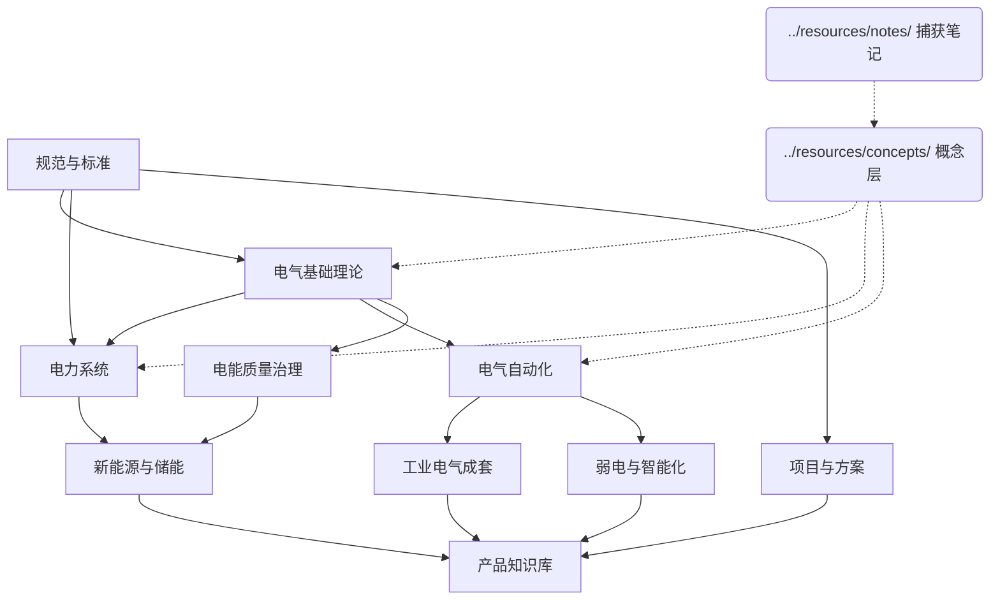

# Areas 首页

> 电气工程领域知识 — 长期维护的核心领域，按 PARA 组织。

## 管线结构

```
raw/                   原始材料（原文转录，不改动）
inspection/            巡检报告（定期审计输出）
knowledge/
  areas/               领域知识（长期负责的电气工程领域）
  resources/
    digest/            消化记录（结构化摘要、概念抽取、冲突标记）
    concepts/          概念卡片（跨来源的独立概念定义）
    topics/            元主题页（知识系统本身的设计）
    notes/             外部捕获笔记（文章/视频/播客的结构化摘要）
  projects/            进行中项目（有明确目标的事项）
  archives/            归档（暂时不用的内容）
  index.md             统一索引（跨层导航）
outputs/               输出产物（按技能类型组织）
    index.html         全文检索应用
    article/           文章/长文
    infographic/       信息图脚本
    pdf/               PDF 文档
    ppt/               演示文稿脚本
    memo/              备忘录/简报
    social/            社交媒体文案
```

## 电气工程

| 模块 | 条目 | 领域 |
|------|------|------|
| [电气基础理论](电气基础理论.md) | 15 | 电路、电磁场、电机、电力电子 |
| [电力系统](电力系统.md) | 17 | 发输变配、用电技术、系统分析、继保、调度 |
| [电气自动化](电气自动化.md) | 12 | PLC、变频器、伺服、DCS/SCADA、通信、机器人 |
| [弱电与智能化](弱电与智能化.md) | 12 | 布线、安防、消防、楼控、集成、照明、IoT |
| [新能源与储能](新能源与储能.md) | 8 | 光伏、风电、储能、氢能、微电网 |
| [电能质量治理](电能质量治理.md) | 13 | 无功补偿、谐波治理、低电压、柔直 |
| [工业电气成套](工业电气成套.md) | 8 | 开关柜、变压器、MCC、UPS |
| [规范与标准](规范与标准.md) | 8 | 国标、行标、企标、国际标准 |
| [产品知识库](产品知识库.md) | 16 | 高压开关、储能、电能质量、竞品 |
| [项目与方案](项目与方案.md) | 6 | 招投标、方案编制、报价 |

## 概念卡片

| 概念 | 领域 | 来源 |
|------|------|------|
| [增量处理](../resources/concepts/concept-incremental-processing.md) | 系统设计 | 消化原则 |
| [Atomic Notes](../resources/concepts/concept-atomic-notes.md) | 知识组织 | 消化原则 |
| [来源追溯](../resources/concepts/concept-source-traceability.md) | 质量管理 | 消化原则 |
| [File Over App](../resources/concepts/concept-file-over-app.md) | 架构原则 | 消化原则 |

## 捕获笔记

| 笔记 | 主题 | 日期 |
|------|------|------|
| [消化原则](../resources/notes/summary-2026-05-30-digestion-principles.md) | 消化层的设计原则和工作流 | 2026-05-30 |
| [_template](../resources/notes/_template.md) | 捕获笔记模板 | — |

## 元主题

| 主题 | 相关概念 | 来源 |
|------|---------|------|
| [LLM 知识系统](../resources/topics/topic-llm-knowledge-system.md) | 增量处理、Atomic Notes、溯源、File Over App | 消化原则 |

## Wiki 图景



## 使用规范

- **页面格式**：YAML frontmatter + Markdown 正文
- **内部链接**：`[电气基础理论](电气基础理论.md)` 跨页面引用；笔记中使用 `[[wikilink]]`
- **状态标记**：`status: complete | partial | shell_only` 标记完整度
- **溯源**：`source_url` + `captured_at` 记录来源

## 待办

- [ ] 用 pi-skills 从外部文章/视频/播客摄取新内容
- [ ] 新增 LLM / AI 相关领域页面
